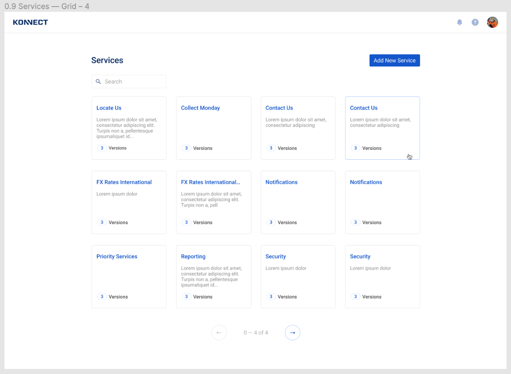

## The User Story

You’re on a team that’s building out a service catalog. The UX designer delivered this mockup: 

The Product Owner delivered the following story:

As a user, I can see an overview of services in my organization. Acceptance criteria include:  

1. User can see the name, a brief description, and versions available for a given service  
2. User can navigate to a given service from its card  
3. User can search for a specific service

## The Assignment

You're responsible for the data model and API portions of this story. Implement a Services API that can be used to implement this dashboard widget. It should support

* Returning a list of services  
  * support filtering, sorting, pagination  
* Fetching a particular service  
  * including a method for retrieving its versions

The API can be read-only.

### Technical Requirements

Use the following tech stack

* Postgres (we're on v15)  
* [Node.js](https://nodejs.org/en/) (we're on v20)  
* [Nest.js](https://nestjs.com/) (we're on v9)  
* [TypeORM](https://typeorm.io/#/) (we're on v0.3)  
* [TypeScript](https://www.typescriptlang.org/)

## Additional considerations

If you have the time and inclination, consider the following:

* Include tests (unit, integration) or a test plan  
* Provide authentication/authorization on the API  
* Add CRUD operations to the API

## How to submit the project

Include a README with your project that describes your design considerations, assumptions and trade-offs made during this exercise.

You have a week to complete this, but we don't expect you to spend more than a few hours on it.  When it's ready, please send your recruiter a link to the source code, **preferably in a github repo**. 